# はじめに
[serverless framework](https://www.serverless.com/)でFargateの開発からstreamlitをデプロイするまでを備忘録として記載。

# セットアップ
nodeやserverlessのinstall・IAMの作成は公式や記事を参照。

## 各種version
node v22.9.01  
serverless 4.4.6  
Docker version 20.10.17, build 100c701  
aws-cli/2.18.5 Python/3.12.6 Linux/5.15.153.1-microsoft-standard-WSL2 exe/x86_64.ubuntu.20

## serverless framework用のIAM
serverless frameworkはdeployまで自動化されるため、強めの権限が必要になるので留意。  
tutorialでは管理者権限といったロールを付与するが、実際の運用においては不要な権限はつけない用に設定必要。

## node package
```sh
node install
```

# 全体構成
※少し自信ないので、詳細把握する  


# directory構成
```sh
.
├── README.md
├── app
│   ├── Dockerfile
│   ├── main.py
│   └── requirements.txt
├── package-lock.json
├── package.json
├── img 
│   └── overall.drawio
└── serverless.yml # serverless framework
```

# 使い方
## deploy
```sh
serverless deploy --stage <stage_name>
```

# 留意事項
- 個人ipアドレスでdeployしたかったが、処理が終わらなかったのでpending
- そのため、deploy後はpublicに公開されるので注意

# 参考文献