# はじめに
[Pythonではじめる数理最適化 ケーススタディでモデリングのスキルを身につけよう](https://www.ohmsha.co.jp/book/9784274227356/)の第6章を題材に、AWSのlambdaにAPIを開発・deployするまでの環境を構築した。  
今回は、AWS lambdaの開発とdeployをserverless frameworkを用いて開発を行った。  

[serverless framework](https://www.serverless.com/)とは、サーバーレスなアプリケーションを簡単に開発からdeployするためのNode.js製のツールである。  
以前は無償だったが、ver 4からは企業規模によって有償となった（個人利用は無料）。

# セットアップ
nodeやserverlessのinstall・IAMの作成は公式や記事を参照。

## 各種version
node v22.9.01  
serverless 4.4.6  
Docker version 20.10.17, build 100c701  
aws-cli/2.18.5 Python/3.12.6 Linux/5.15.153.1-microsoft-standard-WSL2 exe/x86_64.ubuntu.20

## serverless framework用のIAM
serverless frameworkはdeployまで自動化されるため、強めの権限が必要になるので留意。  
tutorialでは管理者権限といったロールを付与するが、実際の運用においては不要な権限はつけない用に設定必要。

## node package
```sh
node install
```

# 全体構成


# directory構成
```sh
.
├── README.md
├── api
│   ├── Dockerfile
│   ├── data # request check用のデータ
│   │   ├── cars.csv
│   │   └── students.csv
│   ├── handler.py # event handler
│   ├── requirements.txt
│   └── src
│       ├── __init__.py
│       └── problem.py # 最適化のコード
├── package-lock.json
├── package.json
├── picutres
│   └── overall.drawio
└── serverless.yml # serverless framework
```

# 使い方
## local環境でのdebug
```sh
serverless offline --stage local
```

## deploy
```sh
serverless deploy --stage <stage_name>
```

## APIへのリクエスト
```sh
curl -X POST -F students=@<data_path>/students.csv -F cars=@<data_path>/cars.csv http://<host_name>/local -o <data_path>/<file_name>
```


# 留意事項
- sercerless offlineとdeploy時のlambdaの挙動が少し違う
- セキュリティ面には配慮していない
  - 本来はAPI keyやVPC・security groupの設定等が必要

# 参考文献
- [Serverless Framework の使い方を初心者にも分かりやすく説明する](https://qiita.com/mkin/items/0a82c84df084496544c6)
- [API Gateway × Lambdaの設定による挙動の違いを見ていく](https://zenn.dev/marokanatani/articles/aws_api_gateway_behavior_go_around)